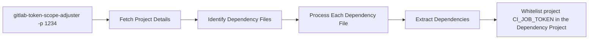

<div align="center">

# GitLab CI Job Token Scope Adjuster


[](https://codecov.io/github/shini4i/gitlab-token-scope-adjuster)


</div>

This CLI tool helps automate the process of configuring CI job token scopes in GitLab projects.

Starting from GitLab 16, it is mandatory to explicitly configure `CI_JOB_TOKEN` access, and this tool simplifies that by
automating the necessary API calls.

> [!WARNING]
> This project is currently in the Proof of Concept (PoC) stage and may be error-prone. It is not recommended for use in production environments.

## How it works?

- Fetches project details from GitLab.
- Identifies dependency files (`go.mod`, `composer.json`, `package-lock.json`) in the repository.
- Extracts dependencies from these files.
- Configures CI job token scopes to whitelist the source project in dependency projects.



> [!NOTE]
> More dependency file types will be added soon. Contributions and suggestions are welcome!

## Prerequisites

- Node.js (>= 22.x)
- ts-node
- GitLab access token with the necessary permissions

## Installation

Install [@shini4i/gitlab-token-scope-adjuster](https://www.npmjs.com/package/@shini4i/gitlab-token-scope-adjuster) package:

```sh
npm install -g @shini4i/gitlab-token-scope-adjuster
```

## Usage

Expose the following environment variable:

```sh
export GITLAB_URL=https://gitlab.example.com
export GITLAB_TOKEN=your_access_token
```

And run the following command:

```sh
gitlab-token-scope-adjuster -p <your_project_id>
```

## Contributing

Pull requests are welcome. For major changes, please open an issue first to discuss what you would like to change.
